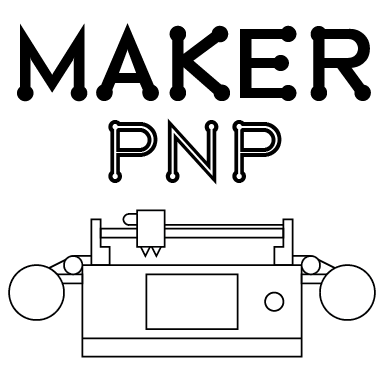

# MakerPnP

Pick-and-Place machine software, for Makers!

## Project Introduction

This project is work-in-progress, you can follow development using the links in the [links](#links) section below. 

## Project Status

Development is currently focussed on the workflow side of PCB assembly. Currently a pure-rust desktop GUI for the
planner is being developed.  There are currently two functional cli tools, planner_cli and variant builder.

Machine operations has not been started yet, it will be started when the process/workflow concepts and tooling matures.

## Architecture

The current architecture is to use Crux to provide rust-based back-ends (cores), and then to write Crux
'shells', also in rust, to provide front-ends (GUI/CLI) or APIs (e.g. web/rpc/etc) which use the common cores.  This
does add a layer of complexity, but should future-proof the project somewhat and also allows creation of non-rust
native apps that use the rust core.  Check out the 'Crux' documentation.

Given the state of Rust GUI frameworks, and that a 3 month-long investigation was done and documented in the form of a 40+ video
series of livestreams, using Crux gives the project a way of being able to change the GUI library for a different one
if the chosen GUI library, Cushy, does not meet future requirements.

See:
* Comparison of GUI libraries - https://docs.google.com/spreadsheets/d/1cxH_GgzrGDpXm4CN0cWvQ9RF_PLf6HEvVYcZhqOO0nc/edit?usp=sharing
* 'Trying Rust GUI tech in 2024' video series playlist - https://www.youtube.com/playlist?list=PLUCLWCDEWm8g7pHKQGE7Pokk4wiVU8rLl 

Currently, it's thought that the software has these main components:
* Machine control - for co-ordination of hardware control through one or more drivers (gcode, cameras, vision).
* Machine operator UI - for machine configuration, job setup, and job operations.  feeders, cameras, head/nozzle/tool
  control, integrates with the machine control and planner components.  
* Planner UI - used to manage assembly projects, can be used without a pick-and-place machine, can generates artifacts
  usable by the operator UI (jobs), with EDA support (KiCad, Diptrace, EasyEda, etc).

If you're familiar with 3D printing, you can think of the Planner as the 'slicer', the operator UI as the 3D printer's
front panel (touchscreen/buttons/display), and Machine control is a bit like the firmware, but not, since the machine
control component will interact with one or more drivers which will communicate to one or more pieces of hardware, each
with their own firmware, where as 3d printers usually only have one main control-board with a single piece of firmware. 

Examples of hardware which *could* be interacted with include:
* dedicated pink-and-place boards, usually via gcode (for x/y/z, vacuum, nozzle control, feeder actuators)
* 3d printer control boards, usually via gcode (again for x/y/z, vacuum, nozzle control, feeder actuators)
* feeder actuator systems (e.g. via RS485/RS232 + arbitrary protocol)
* conveyor/stacker systems (for loading pcbs into a machine)
* local or ip cameras
* and anything else you can dream of.

## Documentation

Written documentation for the project hasn't been created yet.  The design and operation of the tools is detailed in
the livestreams however.  There are also functional tests which detail the expected input/output and operation sequences
so you can refer to those to gain additional understanding.  See `crates/planner_cli/tests/planner.rs` and
`crates/variantbuilder/tests/variantbuider.rs`.

## Links

Please subscribe to be notified of live-stream events so you can follow the development process.

* Patreon: https://www.patreon.com/MakerPnP
* Source: https://github.com/MakerPnP
* Discord: https://discord.gg/ffwj5rKZuf
* YouTube: https://www.youtube.com/@MakerPnP
* X/Twitter: https://x.com/MakerPicknPlace

## Authors

* Dominic Clifton - Project founder and primary maintainer.

## License

TBD (Probably GPL3, Apache or MIT)
