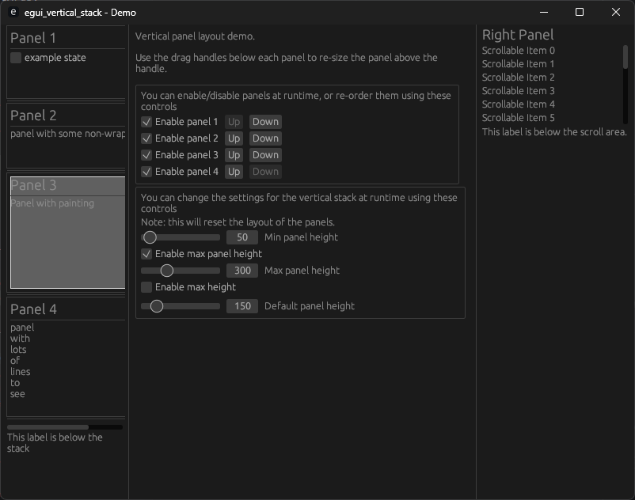

# egui_vertical_stack

A vertical stack of panels.

* Each panel is resizable using a drag handle beneath each panel. 
* Panels can be added/removed/re-ordered at runtime.
* The entire stack is contained in a scroll-area, with support for vertical and horizontal scrolling.
* The min/max/default sizes can be configured.
* The stack of panels can have a maximum height.
* Other elements can be rendered after the stack.

## Demos

The crate contains 2 demos, simple (to get you started) and complex (to show you all the features).

Refer to the `demos` folder.

## Screenshot

Here's a recent screenshot of the complex demo:

## License

Available under APACHE *or* MIT licenses.

* [APACHE](LICENSE-APACHE)
* [MIT](LICENSE-MIT)

## Authors

* Dominic Clifton - Project founder and primary maintainer.

