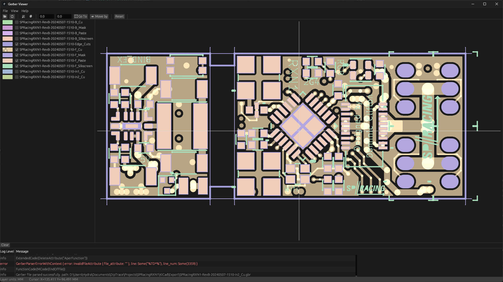
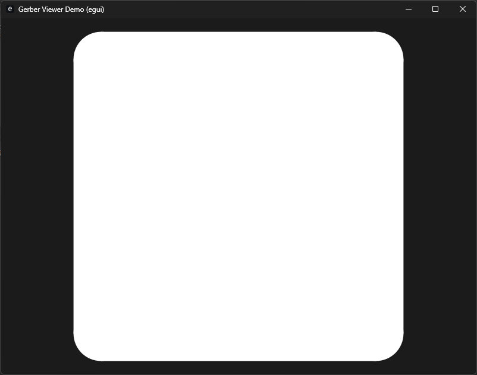

# Gerber viewer

A cargo crate for rendering Gerber Viewers.

Uses `gerber-types` for specification of the gerber commands.

Gerber types can be programatically defined, or gerber files can be imported with the `gerber-parser`

This crate is used as core component of the [MakerPnP](https://github.com/MakerPnP/makerpnp) project, here's a screenshot from the MakerPnP gerber viewer:

[](assets/makerpnp_gerber_viewer/screenshots/gerber_viewer_2025-05-01_221636.png)


## Cargo Features

* `egui` Adds rendering support using egui.
* `parser` Adds the gerber parser as a re-export. This is helpful so you can depend just on this crate and ensures there
  are no version mismatches between the gerber types, gerber parser and gerber rendering.
* `types` Adds the gerber types as a re-export.  See above.

For the default features, see the [`Cargo.toml`](Cargo.toml)

## Demo

There is a minimal stand-alone demo app which renders the `demo/assets/demo.gbr` file.

Run it:
```
cd demo
cargo run --release
```

See `demo/src/main` and `demo/Cargo.toml` for a complete example.



## Rendering

Currently only egui is supported, but the code could be adapted for other rendering methods, PR's welcome.

## Status

Renders many gerbers files, but not all gerber commands and features are supported yet, see below.  The MakerPnP project
is currently the driving force for upcoming changes.

### Supported gerber features

| Supported | Feature                              |
|----------|--------------------------------------|
| ✅        | Plot/Move/Flash (D01/D02/D03)        |
| ✅        | Regions                              |
| ✅        | Aperture macros (AM)                 |
| ✅        | Macro variables                      |
| ✅        | Macro expressions                    |
| ✅        | Vector Line Primitive                |
| ✅        | Center Line Primitive                |
| ✅        | Obround Primitive                    |
| ✅        | Rectangle Primitive                  |
| ✅        | Concave and Convex Polygon Primitive |
| ✅        | Outline Primitive                    |
| ❌        | Thermal Primitive                    |
| ✅        | Linear plotting (G01)                |
| ❌        | Circular plotting (G02/G03)          |
| ❌        | Exposure (Currently only additive)   |
| ❌        | Step-repeat blocks (SR)              |
| ❌        | Block aperture (AB)                  |
| ❌        | File attributes (TF)                 |
| ❌        | Aperture attributes (TA)             |

The above list is likely sufficient for viewing most modern PCB gerber files, the macro support is a key feature.

The list of supported features will be improved as developer time permits, if you'd like to contribute, please see the
 section below.

## Feedback

If you have gerber files and have rendering issues, please create an issue with screenshots and a gerber file.  If
you're able to create a gerber file with just the elements that have issues that would be preferred.

## Contributing

Use the github issue tracker and pull-requests.  If you're embarking on a large change it's usually a good idea to
open an issue first to state your intention, for bug fixes and small changes just open a PR.

## Authors

* Dominic Clifton - Original author and maintainer. (https://ko-fi.com/dominicclifton)

## Contact / Community

See the github issue tracker or join the [MakerPnP discord server](https://discord.gg/ffwj5rKZuf).